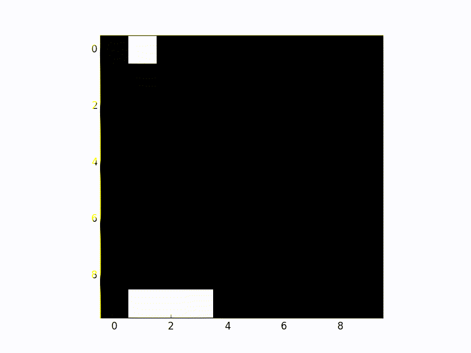

Get started with reinforcement learning in less that 200 lines of code with
Keras (Theano or Tensorflow, it's your choice).

So you are a (Supervised) Machine Learning practitioner that was also sold on the
hype of making your labels weaker and the
possibility of getting neural networks to play your favorite games. You want to
do Reinforcement Learning (RL). But you find it hard to read all those
full featured libraries just to get a feeling of what is actually going on.

Here we got your back, we took the game engine complexities out of the way and
show a minimal Reinforcement Learning example with less than 200 lines of code.
And yes, the example does use Keras, your favorite deep learning library!

Before I give you a link to the code make sure you read Nervana's blog post 
[Demystifying Deep Reinforcement Learning](http://www.nervanasys.com/demystifying-deep-reinforcement-learning/).
There you will learn about Q-learning, which is one of the many ways of doing
RL. Also, at this point you already know that neural nets love mini-batches and there
you will see what is Experience Replay and how to use it to get you them
batches... even in problems where an agent only sees one sample of the environment state
at a time.

So here is the [link for our code](https://gist.github.com/EderSantana/c7222daa328f0e885093).
In this code Keras plays the catch game, where it attempts to 
catch a single pixel "fruit" using a three pixel-wide "basket". The fruit falls one
pixel per step and the Keras network gets a reward of +1 if it catches the
fruit and -1 otherwise. The network sees the entire [10x10 pixels grid](https://gist.github.com/EderSantana/c7222daa328f0e885093#file-qlearn-py-L34-L40)
as input and outputs [three values](https://gist.github.com/EderSantana/c7222daa328f0e885093#file-qlearn-py-L122),
each value corresponding to an action (move left, stay,
move right). Since these values represent the expected accumulated future
reward, we just go greedy and pick the
[action corresponding to the largest value](https://gist.github.com/EderSantana/c7222daa328f0e885093#file-qlearn-py-L147-L148).

One thing to note though, is that this network is not quite like you in exotic
restaurants, it doesn't take the very same action exploiting what it already knows
all the times, once in a while we force system to explore by taking a [random action](https://gist.github.com/EderSantana/c7222daa328f0e885093#file-qlearn-py-L144-L145).
This would be the equivalent of you learning that life goes much beyond just Penang Curry with
fried Tempeh by trial and error.

In the link you will also find scripts that 
plays the game with no random actions and generate the pictures
for the animation above.

Enjoy!

## FAQ
**1) How does this Q-learning thing even work?**

C'mon read the blog post I just mentioned above... Anyways, think like this. The
fruit is one time-step from hitting the ground and your model is just one pixel away from a
"catching" position. The model will face similar cases many many times. If it decides to
stay or move left, it will be punished (imagine a bunch of rotten fruits smelling
in the ground because it was lazy). Thus, it learns to assign a small Q-value
(sounds much better than just "output of neural net", han?) to those two actions
whenever it sees that picture as input. But, since catching the fruit also
gives a juicy +1 reward, the model will learn to assign a larger Q-value to the
"move right" action in this case. This is what minimizing the
[reward - Q-value error](https://gist.github.com/EderSantana/c7222daa328f0e885093#file-qlearn-py-L98-L106) does.

One time-step before that, there will be no reward in the next step.

I liked how the previous phrase sounded, so I decided to give it its own
paragraph. But, although in that case there is no juicy reward right after,
the model can be trained
using the maximum Q-value of the future state in the next step.
Think about it. If you're in the
kitchen you know that you can just open the fridge to get food. But now you're
in your bedroom writing bad jokes and feel hungry. But you have this vague
memory that going to the kitchen could help with that. You just go to the kitchen 
and there you figure how to help yourself. You have to learn all that by living
the game. I know, being Markovian is hard!
But then the rest is just propagating these reward expectations further and
further into the past, assigning high values for good choices and low values
for bad choices (don't forget that sometimes you hit those random choices in
college so you learn the parts of life they don't talk about in school).
For everything else, if you believe in Stochastic Gradient Descent then it is
easy to see this actually making sense... I hope...

**2) How different is this from AlphaGo?**

Not much... But instead of learning Q-values, AlphaGo thought it was
smarter to use REINFORCE and learn to output
action probabilities directly. After that, she played several
games against itself... so many that it could later learn the probability of
winning from each position. Using all that information, during play time she
uses a search technique to look for possible actions that could take her to
positions with higher probability of winning (but she told me to mention here
that she doesn't search as many possibilities in the future as her older cousin
DeepBlue did). She also said that she can play pretty well using just one GPU, the other
99 were running high resolution Netflix series so she can catch up with human
culture.

That being said, you should be able to modify this script in 2 or 3 days to get
a reimplementation or AlphaGo and SkyNet should be 4 weeks away?

JK

**3) Your code sucks why don't you write something better?**

[I'm trying...](https://github.com/EderSantana/X/blob/master/examples/catcher.py)

**4) Did you learn this by yourself?**

The bad parts, yes. The good things were thought me by my friends
Evan Kriminger and Matthew Emigh.
